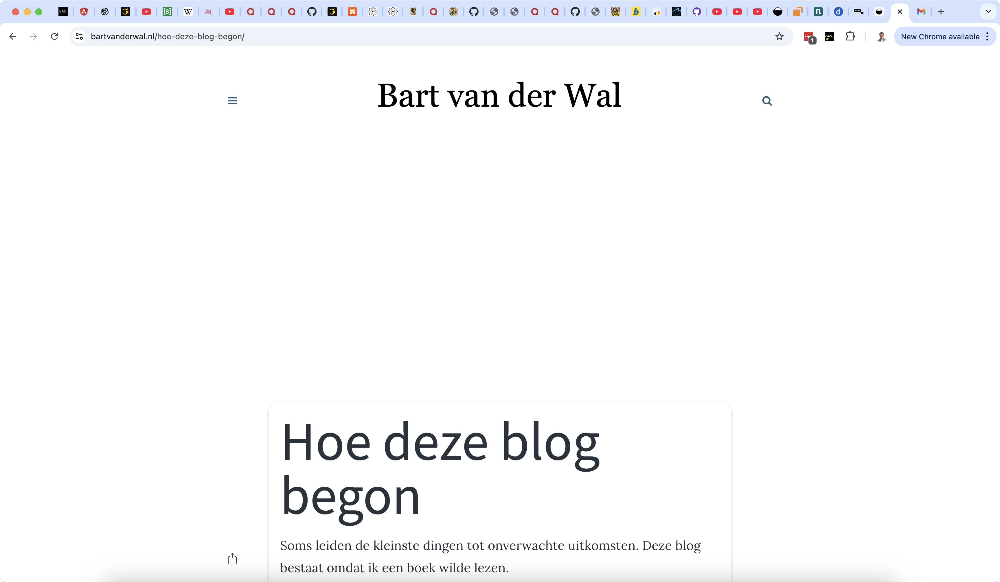

# bartvanderwal.nl

Persoonlijke blog van Bart van der Wal, gebouwd met Jekyll en het Adam Blog 2.0 thema.

## Lokaal draaien

### Eenmalige setup

1. Zorg dat Homebrew Ruby is geïnstalleerd:

```bash
brew install ruby
```

2. Voeg Ruby aan je PATH toe in `~/.zshrc`:

```bash
export PATH="/opt/homebrew/opt/ruby/bin:/opt/homebrew/lib/ruby/gems/3.4.0/bin:$PATH"
unset GEM_HOME GEM_PATH
```

3. Herlaad je shell:

```bash
source ~/.zshrc
```

4. Installeer dependencies:

```bash
bundle install
```

   Als `eventmachine` faalt, gebruik:

```bash
bundle config build.eventmachine --with-cxxflags="-I/Library/Developer/CommandLineTools/SDKs/MacOSX.sdk/usr/include/c++/v1"
bundle install
```

### Development server starten

```bash
bundle exec jekyll serve
```

De site draait dan op `http://localhost:4000`.

## Deployment

Push naar de `main` branch triggert automatisch een GitHub Actions workflow die de site bouwt en deployt naar GitHub Pages.

Live site: `https://bartvanderwal.nl`

## Structuur

```console
├── _posts/           # Blog posts (format: YYYY-MM-DD-titel.md)
├── _pages/           # Statische pagina's
├── assets/images/    # Afbeeldingen
├── _config.yml       # Site configuratie
├── _layouts/         # HTML layouts
├── _includes/        # Herbruikbare HTML componenten
└── .github/workflows/# GitHub Actions voor deployment
```

## Blog post schrijven

Maak een nieuw bestand in `_posts/` met format `YYYY-MM-DD-titel.md`:

```yaml
---
layout: post
title: "Je Post Titel"
date: YYYY-MM-DD
lang: nl
tags: [tag1, tag2]
---

Je content hier in Markdown...
```

## Taal

- **Standaard**: Nederlands (`lang: nl`)
- **Uitzondering**: Quora posts blijven Engels (`lang: en`)

## Thema

Gebaseerd op [Adam Blog 2.0](https://github.com/the-mvm/the-mvm.github.io) door Armando Maynez.



### Originele features

- Dark mode (automatisch)
- Responsive design
- Zoekfunctie
- Tags en categorieën
- Syntax highlighting
- MathJax ondersteuning

### Eigen uitbreidingen

#### SOFA Mode 🛋️

"Start Often, Fail Always" - een filosofie voor het publiceren van draft posts.

- **Toggle in menu**: Wissel tussen gepubliceerde posts en drafts
- **Drafts publiek maar niet crawlbaar**: Zichtbaar via toggle, maar `robots.txt` en `noindex` meta tags voorkomen indexering door zoekmachines
- **Sortering per mode**: Gepubliceerde posts op publicatiedatum, drafts op startdatum

Zie: [Hoe deze blog begon - en het idee erachter](/hoe-deze-blog-begon-en-het-idee-erachter/)

#### Versietabel

Posts kunnen een versiegeschiedenis tonen met meerdere datums:

```yaml
---
date_started: 2024-12-23
started_note: "Eerste idee"
revisions:
  - date: 2024-12-26
    type: Uitgebreid
    note: "Nieuwe sectie toegevoegd"
---
```

De versietabel verschijnt als inklapbaar element bovenaan de post.

#### Archive pagina met thumbnails

De archive pagina toont nu thumbnails naast de post titels.

#### PDF download

Elke post heeft een "Download PDF" knop die client-side een PDF genereert.

## Architectuurbeslissingen (ADRs)

Deze site is gebouwd met [Jekyll](https://jekyllrb.com/), een static site generator in Ruby. Het thema is gebaseerd op [Adam Blog 2.0](https://github.com/the-mvm/the-mvm.github.io) van Armando Maynez. Hosting gebeurt via GitHub Pages met automatische deployment via GitHub Actions.

De belangrijkste architectuurbeslissingen zijn gedocumenteerd in ADRs:

- [ADR-001: Meertaligheid](docs/adr-001-multi-language.md)
- [ADR-002: Jekyll met GitHub Pages](docs/adr-002-jekyll-github-pages.md)
- [ADR-003: Privacy-vriendelijke Analytics](docs/adr-003-analytics.md)
- [ADR-004: PDF Generatie](docs/adr-004-pdf-generation.md)

## Infrastructuur

- [CapRover Multi-Site Setup](docs/caprover-setup.md) - VPS configuratie voor Umami, Spring Boot apps, databases
