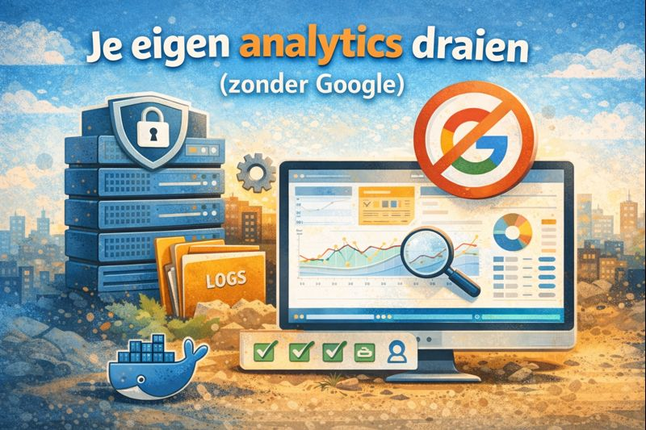
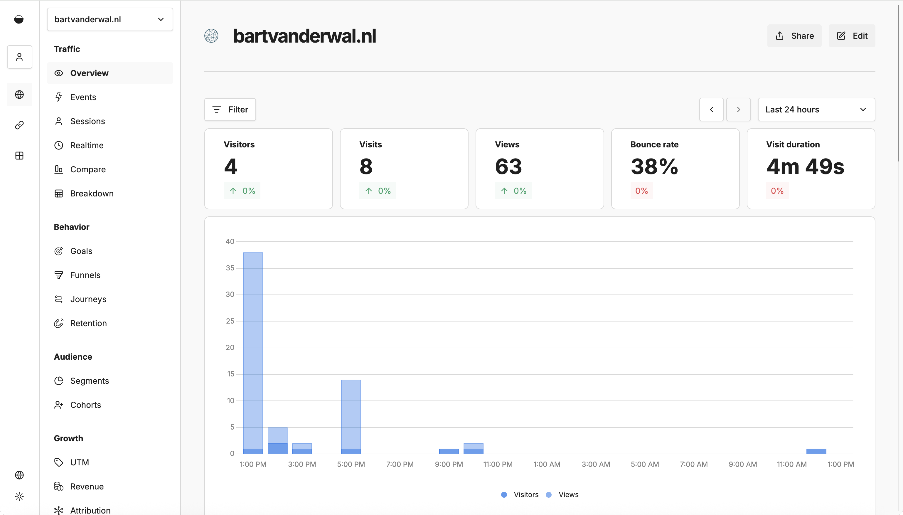

"Wie schrijft die blijft," zei een collega ooit. Ik blog omdat ik graag schrijf over onderwerpen die me interesseren, niet om pageviews te optimaliseren. Maar toen ik deze site opzette, wilde ik toch enige vorm van analytics. Niet zozeer om te weten welke artikelen aanslaan, maar om te leren hoe je analytics privacyvriendelijk kunt implementeren.

Als docent aan de HAN willen we studenten *privacy by design* principes bijbrengen. Het is makkelijk om te zeggen "respecteer de privacy van je gebruikers," maar lastiger om te laten zien hoe dat er in de praktijk uitziet. Deze blog is mijn eigen laboratorium: hoe bouw je een site die wél inzicht geeft in bezoekersgedrag, zonder je lezers uit te leveren aan big tech?

Dit is niet mijn eerste ervaring met analytics. Jaren geleden, toen ik nog fulltime .NET developer was, deed ik aan de kant SEO-werk voor klanten. Google Analytics was toen vanzelfsprekend. Je plakte het script in je pagina en kreeg inzicht in je bezoekers. Over privacy dachten we nauwelijks na; het was gewoon hoe het web werkte.

Maar het web is veranderd, en mijn perspectief ook.

## Het probleem met "gratis"

Bij Google Analytics betaal je niet met geld, maar met de data van je bezoekers. Elke pageview, elke klik, elke seconde wordt vastgelegd en gekoppeld aan profielen die Google over je bezoekers bouwt. Voor een persoonlijke blog voelde dat verkeerd. Mijn lezers komen hier voor artikelen over software development en swimrun, niet om getrackt te worden door een advertentiemoloch.

### Google Analytics en DoubleClick

Wat veel mensen niet beseffen is dat Google Analytics niet op zichzelf staat. Het is diep geïntegreerd met Google's advertentienetwerk DoubleClick. Google (2025) documenteert dat de DoubleClick-cookie wordt gebruikt door websites die remarketing en display advertising campagnes draaien. Wanneer je Google Analytics installeert met de standaard configuratie, kunnen cookies van doubleclick.net worden geplaatst die bezoekers over het hele web volgen. Die banner "we gebruiken cookies voor een betere ervaring" vertaalt zich in werkelijkheid naar: we bouwen een profiel van je surfgedrag om je later advertenties te tonen.

Daarnaast vereist Google Analytics cookies, wat betekent dat je onder de GDPR verplicht bent om expliciete toestemming te vragen. Vandaar die cookiebanners die het hele web teisteren. Die banners zijn niet alleen irritant voor bezoekers, ze zijn ook een symptoom van een dieper probleem: we hebben massasurveillance genormaliseerd.

### Van adtech naar mainstream software

Ironisch genoeg komt MongoDB, de document database die we bij de HAN in het Web Development curriculum onderwijzen, ook uit de stal van DoubleClick. Dwight Merriman, medeoprichter en CTO van DoubleClick, startte later 10gen, het bedrijf achter MongoDB (Chodorow, 2010). Bij DoubleClick leerden ze de limieten van relationele databases kennen toen ze 400.000 advertenties per seconde moesten serveren. Die schaalervaring leidde tot MongoDB. Het is een mooi voorbeeld van hoe adtech-innovatie overloopt naar de bredere software-industrie, maar het illustreert ook hoe verweven de techwereld is met de advertentie-economie.

### De open source paradox

Dit open sourcen door grote techbedrijven is een onderbelicht aspect in de discussie over big tech. Bedrijven die normaal elkaars concurrenten zijn, delen vrijelijk hun technologie. MongoDB, React van Facebook, Kubernetes van Google, TypeScript van Microsoft. De verklaring zit deels in de cultuur: de gemiddelde developer denkt niet primair competitief, maar wil vooral dingen voor elkaar krijgen. Open source maakt snellere innovatie mogelijk, en daar profiteert uiteindelijk iedereen van.

### Enshittification en de gebruiker als product

Maar dit laat onverlet dat diezelfde bedrijven op andere vlakken keihard concurreren, en dat hun gedrag leidt tot wat Cory Doctorow [*enshittification*](https://en.wikipedia.org/wiki/Enshittification) noemt. In zijn recente boek *Enshittification: Why Everything Suddenly Got Worse and What to Do About It* (Doctorow, 2025) beschrijft hij het patroon: platforms beginnen met waarde leveren aan gebruikers, verschuiven vervolgens naar zakelijke klanten, en trekken uiteindelijk alle waarde naar zichzelf toe. CEO's en bedrijfsleiding stellen groei op korte termijn boven gezond gedrag op lange termijn. De belangen van gebruikers komen niet vooraan.

Deels is dat ook onze eigen schuld. Gebruikers zijn zelden bereid te betalen voor diensten, en verkiezen liever het product te zijn dan het product te kopen. Over alternatieven als micropayments wellicht een andere keer meer. Voor nu volstaat de constatering dat "gratis" zelden gratis is, en dat de kosten vaak pas later zichtbaar worden.

Dit is ook waarom ik [Facebook heb verlaten](/weg-van-facebook/). De waarde die ik eruit haalde woog niet meer op tegen wat ik ervoor inleverde.

## De zoektocht naar alternatieven

Er zijn tegenwoordig gelukkig alternatieven. Plausible en Fathom zijn populaire hosted opties die privacy respecteren, maar kosten rond de tien euro per maand. Voor een hobbyblog is dat lastig te rechtvaardigen. Toen stuitte ik op Umami: een open source analytics platform dat je zelf kunt hosten. De belofte klonk goed: volledige analytics functionaliteit, zonder cookies, en volledig onder eigen beheer.

De installatie bleek verrassend eenvoudig. Een Docker Compose bestand met twee containers, Umami zelf en een PostgreSQL database, en na tien minuten draaide alles op mijn VPS. De interface is modern en overzichtelijk, een verademing vergeleken met de complexiteit van Google Analytics. Je ziet pageviews, referrers, en browsers zonder te verdrinken in data die je toch nooit gebruikt.

## Wat Umami anders doet

Een cruciaal verschil met Google Analytics is hoe Umami data opslaat. Umami registreert alleen geaggregeerde statistieken: het totaal aantal bezoekers uit Nederland, het totaal aantal Chrome-gebruikers, het totaal aantal pageviews per artikel. Er worden geen individuele bezoekersprofielen aangemaakt (Umami, 2025). Je kunt niet terugzoeken wat één specifieke bezoeker heeft gedaan, omdat die informatie simpelweg niet bestaat in de database.

Dit is fundamenteel anders dan Google Analytics, dat juist individuele user journeys tracked en aan profielen koppelt. Bij Umami verdwijnt de individuele bezoeker in de massa zodra de pageview is geteld.

## De juridische werkelijkheid

Hier moet ik eerlijk zijn: mijn aanvankelijke aanname dat Umami volledig vrijgesteld zou zijn van GDPR-vereisten blijkt te simplistisch.

De GDPR definieert persoonlijke data breed. Artikel 4, lid 1 stelt letterlijk:

> "'persoonsgegevens': alle informatie over een geïdentificeerde of identificeerbare natuurlijke persoon ('de betrokkene'); als identificeerbaar wordt beschouwd een natuurlijke persoon die direct of indirect kan worden geïdentificeerd, met name aan de hand van een identificator zoals een naam, een identificatienummer, locatiegegevens, een online identificator..." (Europese Unie, 2016)

Recital 30 verduidelijkt dat IP-adressen onder die "online identificatoren" vallen (Europese Unie, 2016). Het maakt juridisch niet uit of je het IP-adres permanent opslaat; het verwerken ervan, zelfs tijdelijk om een land te bepalen, is al voldoende om onder de GDPR te vallen.

Umami leest het IP-adres van bezoekers om geografische statistieken te genereren. Hoewel het adres daarna wordt weggegooid en alleen het land als geaggregeerde statistiek overblijft, vindt er technisch gezien wel verwerking plaats. De Franse toezichthouder CNIL hanteert een strikte interpretatie: zelfs deze vorm van verwerking vereist mogelijk consent (Reddit r/gdpr, 2024).

Dit betekent niet dat Umami even problematisch is als Google Analytics. Het verschil in schaal en intentie is enorm. Umami verzamelt minimale data, slaat geen profielen op, en deelt niets met derden. Maar juridisch gezien opereer je met Umami in een grijs gebied.

## Een pragmatische afweging

Wat doe je met die wetenschap? Je hebt enkele opties.

De strengste interpretatie volgen betekent een consent banner tonen, ook voor Umami. Dat is juridisch het veiligst, maar ondermijnt een van de redenen om over te stappen: de schone gebruikerservaring zonder popups.

Een andere optie is de geografische functie in Umami uitschakelen. Zonder land-detectie verwerk je geen IP-adressen meer voor dat doel, en vervalt mogelijk de GDPR-verplichting. Je verliest wel inzicht in waar je lezers vandaan komen.

De derde optie is een risicoafweging maken. Voor een persoonlijke blog met bescheiden traffic is de kans op handhaving minimaal. Je verzamelt geen gevoelige data, bouwt geen profielen, en hebt geen commercieel belang. Dit is geen juridisch advies, maar een realistische inschatting.

Ik heb voor die laatste optie gekozen, met de kanttekening dat ik de situatie blijf volgen. Mocht de juridische consensus verschuiven, dan pas ik aan.

## Het alternatief: Nginx logs

Voordat je een aparte analytics-applicatie installeert, is het goed om te beseffen dat je webserver al data verzamelt. Nginx, die ik gebruik als reverse proxy, logt standaard elke request. Met een tool als GoAccess kun je die logs omzetten naar visuele rapporten zonder enige JavaScript op je site te plaatsen (GoAccess, 2025).

GoAccess is elegant in zijn eenvoud: het parseert logbestanden en genereert HTML-rapporten of draait real-time in je terminal. Geen database nodig, geen extra containers, geen client-side tracking. Je krijgt pageviews, top pagina's, referrers, en browsers, allemaal uit data die je server sowieso al verzamelt.

Het nadeel is dat je minder gedetailleerde informatie krijgt. Nginx logs bevatten geen informatie over hoe lang iemand op een pagina blijft, of waar ze naartoe scrollen. Voor een blog is dat meestal geen probleem; je wilt vooral weten welke artikelen worden gelezen, niet het exacte gedrag van elke bezoeker.

Een bijkomend voordeel van Nginx is dat je direct rate limiting kunt inschakelen om je site te beschermen tegen overmatig verkeer. Dat is een onderwerp voor een apart artikel, maar het illustreert hoe je met standaard server-tooling veel kunt bereiken zonder externe diensten.

Uiteindelijk koos ik toch voor Umami vanwege de mooiere interface en de mogelijkheid om statistieken publiek te delen. Je kunt mijn statistieken bekijken op de [statistieken pagina](/stats/).

## Conclusie

Self-hosted analytics met Umami is een stap in de goede richting. Je data blijft op je eigen server, er is geen derde partij die meekijkt, en je respecteert de privacy van je bezoekers meer dan met Google Analytics. Maar het is geen vrijbrief om alle GDPR-zorgen te negeren.

De eerlijke boodschap is: privacy-vriendelijke analytics verminderen het probleem, maar lossen het niet volledig op. Zolang we IP-adressen gebruiken om het web te laten functioneren, blijft er een spanning bestaan tussen bruikbare statistieken en absolute privacy. De vraag is niet of je die spanning kunt elimineren, maar hoe je er verantwoord mee omgaat.

## Bronnen

- Chodorow, K. (23 augustus 2010). *History of MongoDB*. Geraadpleegd op 24 december 2025 van kchodorow.com/2010/08/23/history-of-mongodb
- Doctorow, C. (oktober 2025). *Enshittification: Why Everything Suddenly Got Worse and What to Do About It*. Farrar, Straus and Giroux.
- Doctorow, C. (29 april 2025). *Cory Doctorow at CF 25: How Enshittification Conquered the 21st Century and How We Can Overthrow It* [Video]. CloudFest. Geraadpleegd op 24 december 2025 van youtube.com/watch?v=_Ai-fC-2Bpo
- Europese Unie. (27 april 2016). *Verordening (EU) 2016/679 betreffende de bescherming van natuurlijke personen in verband met de verwerking van persoonsgegevens (Algemene Verordening Gegevensbescherming)*. Geraadpleegd op 24 december 2025 van eur-lex.europa.eu/eli/reg/2016/679/oj
- GoAccess. (2025). *GoAccess - Visual Web Log Analyzer*. Geraadpleegd op 24 december 2025 van goaccess.io
- Google. (2025). *Cookie information for Google's ad products*. Geraadpleegd op 24 december 2025 van business.safety.google/adscookies
- Reddit r/gdpr. (september 2024). *Can you use Umami free analytics in a web app?*. Geraadpleegd op 24 december 2025 van reddit.com/r/gdpr/comments/1fejjqn
- Umami. (2025). *Privacy*. Geraadpleegd op 24 december 2025 van umami.is/docs/guides/privacy
- Wikipedia. (2025). *Enshittification*. Geraadpleegd op 24 december 2025 van en.wikipedia.org/wiki/Enshittification
