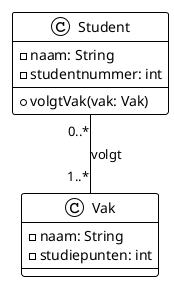

*Ik heb gisteren mijn lange duurloop niet gedaan 😅. Ik zat weer veel te lang achter mijn beeldscherm 🥲. Een ideetje vanuit mijn werk liet me niet los. En programmeerwerk duurt vaak stuk langer dan je denkt. Nog even, nog even.. en zo zit je nog uren, de 80% moeite te steken in die laatste 20% werk. Want je moet toch op 100% komen. The reverse Pareto regel. Maar ik heb nu wel op NPM staan (npmjs.org): mijn 1e NodeJS in jaren open source module gepublished: remark-kroki-a11y Totaal zit ik nu op vier.*

Komende week start een nieuw onderwijsblok en we zijn in lesmateriaal en (digitale) toetsen aan het kijken naar de toegankelijkheid ervan voor slechtziende en blinde studenten. Daarvan zijn er eigenlijk nog veel te weinig in ons onderwijs — en dat ligt misschien ook wel aan ons.

Programma code leent zich prima voor visueel beperkten, die hun screenreaders het laten voorlezen. En 'blindtypen' gaat sneller dan ziend typen (ook voor 'zienden'). Alleen plaatjes zijn wel een obstakel. In Software Engineering gebruiken we veel diagrammen. Met bolletjes en pijltjes. Of vierkanten en pijltjes worden het meestal.

Een collega bedacht zich dat de 'diagrams-as-code' aanpak die we hanteren ook een betere instap biedt om het toegankelijk te maken, dan de plaatjes die hier uit komen. We gebruiken diagram-as-code formaten zoals PlantUML en Mermaid vooral omdat de voorbeelddiagrammen bij onze opdrachten dan makkelijk onderhoudbaar zijn. We hoeven niet de plaatjes zelf aan te passen, maar gewoon de code erachter. Dit kunnen we in versiebeheer houden, samen met de setup van codeprojecten. In `git diff` zie je welke aanpassingen op welk moment gemaakt zijn. En alles komt zo online als eigen website (we gebruiken Docusaurus).

In dit artikel beschrijf ik de plugin die we hiervoor gemaakt hebben. Sectie 1 legt het probleem uit. Sectie 2 beschrijft hoe diagrams-as-code een kans biedt. Sectie 3 introduceert de plugin, met het concept van situationele beperking en de roadmap voor verdere ontwikkeling. Sectie 4 illustreert het met een onverwacht voorbeeld: Roodkapje als UML.

## 1. Het probleem: visuele diagrammen in een tekstuele wereld

UML diagrammen, C4 architectuurvisualisaties, flowcharts — het zijn krachtige communicatiemiddelen. Een goed diagram kan complexe relaties in één oogopslag duidelijk maken. Maar die "oogopslag" is precies het probleem.

Voor mensen die blind of slechtziend zijn, zijn deze diagrammen onzichtbaar. Een screenreader leest de alt-tekst van een afbeelding voor, maar wat schrijf je als alt-tekst voor een klassendiagram met tien klassen en vijftien relaties? "Klassendiagram" is te weinig informatie. Een volledige beschrijving wordt al snel een muur van tekst.

De European Accessibility Act (EAA) stelt vanaf 2025 eisen aan digitale toegankelijkheid. WCAG 2.1 niveau AA is de standaard. Maar los van wetgeving: als we als opleiding zeggen dat we inclusief willen zijn, dan moeten onze materialen dat ook zijn.

## 2. Diagrams-as-code: de oplossing zit in de bron

Hier komt een interessant inzicht: moderne diagramtools zoals PlantUML en Mermaid genereren diagrammen uit tekstuele broncode. Die broncode is per definitie toegankelijk — het is gewoon tekst.

Het Mermaid-project verwoordt dit mooi:

> "The entire concept of Mermaid is that we can represent this visual content as plain structured text. Mermaid diagrams aren't just static images generated in Photoshop; they are rendered dynamically from structured data."

De broncode bevat alle informatie die in het diagram zit. We moeten het alleen op de juiste manier presenteren.

Hier een voorbeeld van een eenvoudig klassendiagram. De PlantUML broncode:



Dit beschrijft een `Student` met attributen `naam` en `studentnummer`, en een relatie met `Vak`. Een screenreader kan deze tekst voorlezen — het visuele diagram niet. Dat is precies het punt: de broncode *is* de toegankelijke beschrijving.

## 3. remark-kroki-a11y: de plugin

Een collega (Remco Veurink) kwam met een setup voor kleine customisatie van een Docusaurus plugin, `remark-kroki`, die we gebruiken om tijdens het opleveren van een nieuwe versie van de website alle diagrammen opnieuw te genereren. De plugin genereert naast het plaatje ook de originele code.

Ik maakte er een uitklapbalkje van, zodat reguliere studenten niet al deze afleidende tekst krijgen — maar de code wel kunnen gebruiken om zelf te visualiseren met een online tool, en eventueel aanpassingen te maken. Toen bedacht ik me dat je het diagram ook als natuurlijke taal zou kunnen beschrijven. En toen was het weekend voorbij.

De huidige 0.3 versie zet twee diagramtypes om naar natuurlijke taal: klassendiagrammen en sequentiediagrammen (de twee meest gebruikte). Deze beschrijvingen zijn bedoeld voor screenreaders, maar zijn ook nuttig voor zienden die *situationeel beperkt* zijn — in de zin dat ze deze diagrammen nog niet goed kennen en dus zelf nog niet kunnen "oplezen". Beginnende studenten dus.

### Situationele beperking

Dit concept van situationele beperking is belangrijk. Toegankelijkheid wordt vaak gezien als iets voor "mensen met een beperking", maar iedereen is wel eens situationeel beperkt. Je bent slechtziend als je zonder bril wakker wordt. Je bent slechthorend in een lawaaierige trein. En je bent "diagram-analfabeet" als je nog nooit UML hebt gezien.


*Figuur 1:* Permanente, tijdelijke en situationele beperkingen. Gebaseerd op Chugaievska (2023), uitgebreid met een vierde voorbeeld: een student die UML nog niet kent.

Door de natuurlijke-taalbeschrijving toe te voegen helpen we niet alleen blinde studenten, maar ook beginners die de diagramsyntax nog moeten leren. De beschrijving is een brug naar begrip.

### Wat de plugin doet

1. **Toont de broncode** — In een inklapbaar `<details>` element onder elk diagram
2. **Genereert natuurlijke-taalbeschrijvingen** — Voor ondersteunde diagramtypes
3. **Biedt tabs** — Gebruikers kiezen tussen broncode en beschrijving
4. **Ondersteunt lokalisatie** — Nederlands en Engels

### Wat er nog kan komen

Het lectoraat Accessible Digital Tools and Engineering heeft interesse getoond om studenten te begeleiden bij verdere uitbreiding. Denk aan:

- Echte ARIA-labels met betere navigatiestructuur
- Meer diagramtypes: pie charts, bar charts, activity diagrams (Mermaid ondersteunt er 14)
- Meer talen — meer talen is ook meer toegankelijk
- Op termijn: de a11y-code integreren in de oorspronkelijke diagram-as-code tools, in plaats van als aparte plugin

More Accessible Software Engineering for the world — mede dankzij de HAN.

De plugin staat op npm en GitHub: [github.com/bartvanderwal/remark-kroki-a11y](https://github.com/bartvanderwal/remark-kroki-a11y).

### Architectuur-alternatieven voor Jekyll

De remark-kroki-a11y plugin is gebouwd voor Docusaurus (remark/unified ecosystem). Voor Jekyll zijn er drie mogelijke aanpakken:

```plantuml
@startuml
!include https://raw.githubusercontent.com/plantuml-stdlib/C4-PlantUML/master/C4_Component.puml

title Drie architectuur-alternatieven voor A11y in Jekyll

Container_Boundary(optie1, "Optie 1: Pre-build Script") {
    Component(prebuild, "Pre-build Script", "Node.js", "Roept remark-kroki-a11y aan vóór Jekyll build")
    Component(cache, "A11y Cache", "JSON", "Cached beschrijvingen per diagram")
}

Container_Boundary(optie2, "Optie 2: Shared Core") {
    Component(core, "a11y-diagram-core", "npm package", "Gedeelde parsing logic")
    Component(remark, "remark-kroki-a11y", "Remark plugin", "Gebruikt core")
    Component(jekyll, "jekyll-diagram-a11y", "Ruby gem", "Gebruikt core via node")
}

Container_Boundary(optie3, "Optie 3: Client-side JS") {
    Component(spaceship, "Jekyll Spaceship", "Ruby gem", "Rendert diagram als img")
    Component(clientjs, "diagram-a11y.js", "JavaScript", "Decodeert URL, genereert beschrijving")
}

SHOW_LEGEND()
@enduml
```

**Optie 1** hergebruikt de bestaande plugin maximaal. **Optie 2** vereist refactoring naar een gedeelde core. **Optie 3** dupliceert de logic in JavaScript maar werkt direct.

## 4. Roodkapje als UML: een introductie in diagrammen

Om de plugin te demonstreren — en tegelijk UML te introduceren — gebruiken we een onverwacht domein: het sprookje van Roodkapje.

Dit voorbeeld toont hoe je een verhaal in natuurlijke taal kunt vertalen naar formele diagrammen. Het is een prima introductie voor niet-technici of beginnende technici.

Roodkapje is wellicht een gimmick, maar ook een manier om analyse en ontwerp toe te passen op een bekend domein. Ervaren IT-ers classificeren op een gegeven moment technische complexiteit als 'accidental complexity' — die je minimaliseert — en domeincomplexiteit als 'inherent complexity' — die je maximaliseert door een complex domein te zoeken waar nog veel te verbeteren valt.

Denk aan innovatie in de **energietransitie**: zelfrijdende auto's, robotisering van arbeid, de stikstof-transitie. Of de **zorg**: persoonsgebonden medicijnen, lifestyle-interventies tegen welvaartsziekten. Dit zijn thema's waar HAN ICT zich op richt — complexe domeinen waar software verschil maakt.

### Vermijd "The One Diagram to rule them all"

We splitsen het Roodkapje-verhaal op in drie delen om een "God Diagram" te voorkomen. Een God diagram is een anti-pattern, net als een 'God object' in code. Het opsplitsen beperkt cognitive load. Om toch overzicht te bieden maak je een apart diagram voor de onderlinge verbanden — vergelijkbaar met C4 zoomniveaus.

Het volledige voorbeeld staat in de plugin documentatie: [Roodkapje als UML diagrammen](https://bartvanderwal.github.io/remark-kroki-a11y/examples/roodkapje-als-uml-diagrammen).

## 5. Meta: eating our own dog food

Dit project heeft een meta-aspect: we bouwen een toegankelijkheids-plugin voor diagrammen, en gebruiken diezelfde diagrammen om de plugin te documenteren. De documentatiesite is tegelijk testsite.

Als de diagrammen niet toegankelijk zijn, faalt de plugin. Als ze wel toegankelijk zijn, bewijst de documentatie zichzelf.

## Bronnen

- Chugaievska, N. (27 januari 2025). *Designing for Everyone: Addressing Permanent, Temporary, and Situational Limitations*. Medium. Geraadpleegd van https://medium.com/@natalia.chugaievska/designing-for-everyone-addressing-permanent-temporary-and-situational-limitations-c3992b0e622e
- Mermaid. (2024). *Accessibility discussion*. Geraadpleegd van https://github.com/mermaid-js/mermaid/issues/5632
- Van der Wal, B. (2026). *remark-kroki-a11y*. Geraadpleegd van https://github.com/bartvanderwal/remark-kroki-a11y
- W3C. (2018). *Web Content Accessibility Guidelines (WCAG) 2.1*. Geraadpleegd van https://w3.org/TR/WCAG21/
